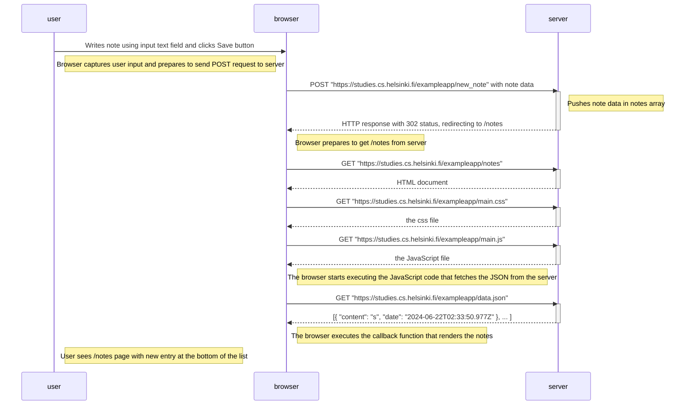

```mermaid
sequenceDiagram
    participant user
    participant browser
    participant server

    user->>browser: Writes note using input text field and clicks Save button
    Note left of browser: Browser captures user input and prepares to send POST request to server

    browser->>server: POST "https://studies.cs.helsinki.fi/exampleapp/new_note" with note data
    activate server
    Note right of server: Pushes note data in notes array
    server-->>browser: HTTP response with 302 status, redirecting to /notes
    deactivate server

    Note right of browser: Browser prepares to get /notes from server
    browser->>server: GET "https://studies.cs.helsinki.fi/exampleapp/notes"
    activate server
    server-->>browser: HTML document
    deactivate server

    browser->>server: GET "https://studies.cs.helsinki.fi/exampleapp/main.css"
    activate server
    server-->>browser: the css file
    deactivate server

    browser->>server: GET "https://studies.cs.helsinki.fi/exampleapp/main.js"
    activate server
    server-->>browser: the JavaScript file
    deactivate server

    Note right of browser: The browser starts executing the JavaScript code that fetches the JSON from the server

    browser->>server: GET "https://studies.cs.helsinki.fi/exampleapp/data.json"
    activate server
    server-->>browser: [{ "content": "s", "date": "2024-06-22T02:33:50.977Z" }, ... ]
    deactivate server

    Note right of browser: The browser executes the callback function that renders the notes
    Note right of user: User sees /notes page with new entry at the bottom of the list
```