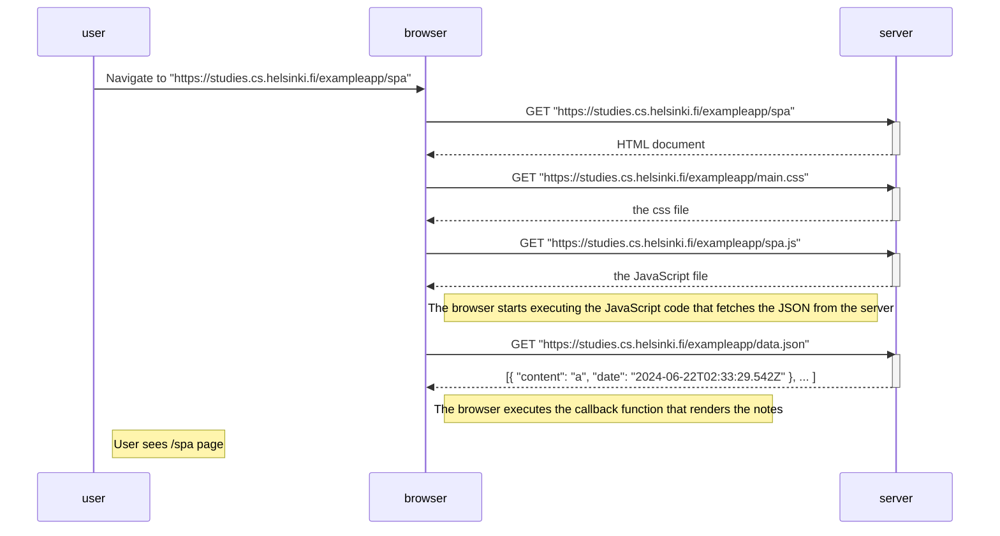

```mermaid
sequenceDiagram
    participant user
    participant browser
    participant server

    user->>browser: Navigate to "https://studies.cs.helsinki.fi/exampleapp/spa"

    browser->>server: GET "https://studies.cs.helsinki.fi/exampleapp/spa"
    activate server
    server-->>browser: HTML document
    deactivate server

    browser->>server: GET "https://studies.cs.helsinki.fi/exampleapp/main.css"
    activate server
    server-->>browser: the css file
    deactivate server

    browser->>server: GET "https://studies.cs.helsinki.fi/exampleapp/spa.js"
    activate server
    server-->>browser: the JavaScript file
    deactivate server

    Note right of browser: The browser starts executing the JavaScript code that fetches the JSON from the server

    browser->>server: GET "https://studies.cs.helsinki.fi/exampleapp/data.json"
    activate server
    server-->>browser: [{ "content": "a", "date": "2024-06-22T02:33:29.542Z" }, ... ]
    deactivate server

    Note right of browser: The browser executes the callback function that renders the notes
    Note right of user: User sees /spa page
```