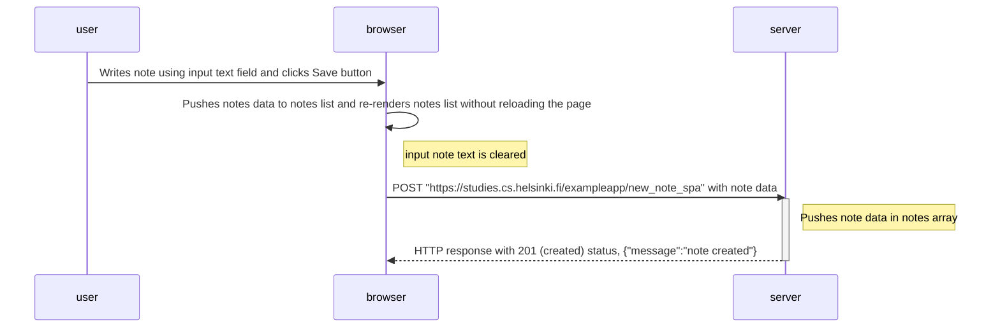

```mermaid
sequenceDiagram
    participant user
    participant browser
    participant server

    user->>browser: Writes note using input text field and clicks Save button
    browser->>browser: Pushes notes data to notes list and re-renders notes list without reloading the page
    Note right of browser: input note text is cleared
    browser->>server: POST "https://studies.cs.helsinki.fi/exampleapp/new_note_spa" with note data
    activate server
    Note right of server: Pushes note data in notes array
    server-->>browser: HTTP response with 201 (created) status, {"message":"note created"}
    deactivate server
```